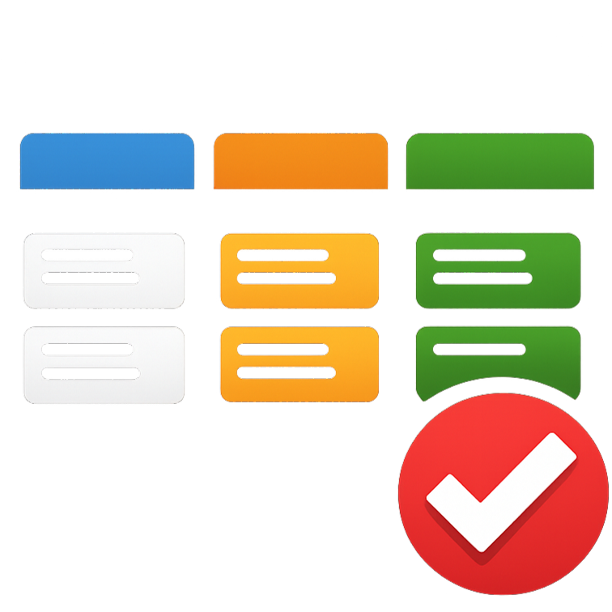
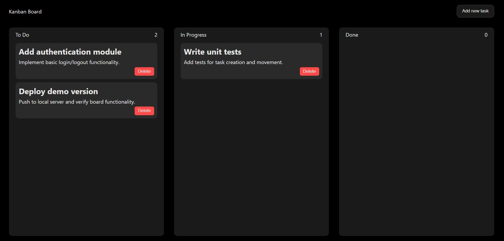

<h1>
  
  Kanban Board
</h1>

A responsive **Kanban Task Management Board** built using **HTML, CSS, and Vanilla JavaScript**.

This project allows users to create, drag, delete, and persist tasks across workflow stages with browser-based storage.

<br>

## Live Demo


[https://rishi13mm.github.io/kanban-board](https://rishi13mm.github.io/kanban-board/)


<br>

## Preview



<br>

## Features

* ➕ Add new tasks (Title + Description)
* 🗑️ Delete tasks
* 🔄 Drag & Drop between columns
* 📊 Real-time task count update
* 💾 Data persistence using `localStorage`
* 📱 Fully responsive design (Tablet + Mobile)
* 🎨 Clean UI using CSS Variables
* 🧩 Modular JavaScript structure

<br>

## How It Works

### 🔹 Task Creation

Tasks are dynamically created and appended to the **To Do** column using DOM manipulation.

### 🔹 Drag & Drop

Implemented using the **HTML5 Drag and Drop API**:

* `dragstart` – identifies dragged task
* `dragover` – enables drop area
* `drop` – moves task to selected column

### 🔹 State Persistence

Tasks are stored in `localStorage` in structured format:

```json
{
  "todo": [
    { "title": "Task 1", "description": "Description" }
  ],
  "progress": [],
  "done": []
}
```

On page reload:

* Stored tasks are retrieved
* Tasks are dynamically reconstructed

<br>

## Project Structure

```
kanban-board/
│
├── index.html
├── README.md
├── .gitignore
│
└── src/
    ├── css/
    │   └── style.css
    │
    ├── js/
    │   └── script.js
    │
    └── assets/
        └── favicon.png
```

<br>

## Technologies Used

* HTML5
* CSS3 (Flexbox + Media Queries + Variables)
* JavaScript 
* LocalStorage API
* HTML5 Drag & Drop API

<br>

## Responsive Design

The layout adapts using media queries:

* Desktop: 3-column layout
* Tablet: Adjusted spacing & font scaling
* Mobile: Columns stack vertically

<br>

## Current Limitations

* No backend/database integration
* No user authentication
* Drag reordering within the same column is not supported
* Uses `innerHTML` (potential XSS risk if not sanitized)

<br>

## Learning Outcome

This project strengthened my understanding of:

* State persistence in frontend applications
* Event-driven architecture
* Drag-and-drop interactions
* Responsive UI design
* Modular JavaScript structure

<br>

## How to Run Locally

1. Clone the repository:

```bash
git clone https://github.com/your-username/kanban-board.git
```

2. Navigate to project folder:

```bash
cd kanban-board
```

3. Open `index.html` in your browser.

No dependencies required.

<br>

## 👨‍💻 Author

**Rishi**
(MCA Student)